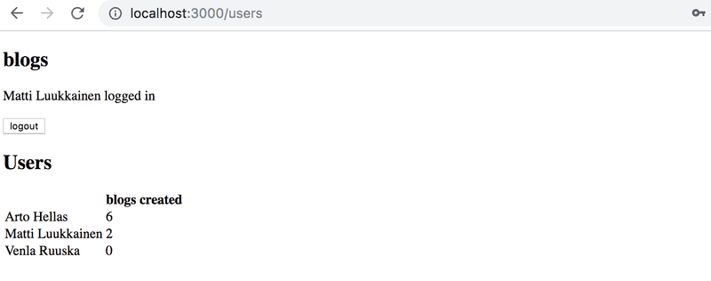
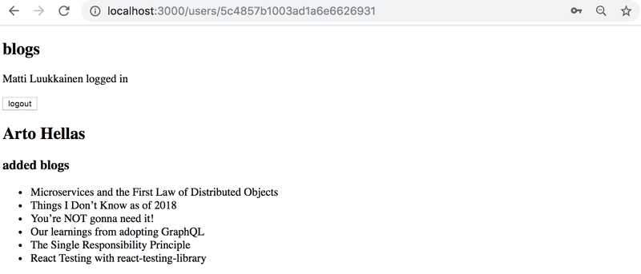
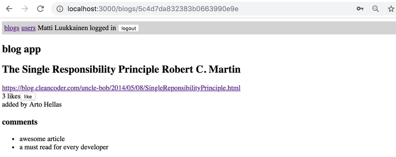

# Exercises

## Exercises 7.1-7.6: [routed-anecdotes](https://github.com/jokerinya/fsopen-part7/tree/main/routed-anecdotes)

## Exercise 7.7: [country-hook](https://github.com/jokerinya/fsopen-part7/tree/main/country-hook)

## Exercise 7.8: [ultimate-hooks](https://github.com/jokerinya/fsopen-part7/tree/main/ultimate-hooks)

> ## Exercises 7.9 - 7.21

## 7.9: automatic code formatting

In the previous parts we used ESLint to ensure that code to follows the defined
conventions. [Prettier](https://prettier.io/) is yet another approach for the
same. According to the documentation Prettier is an opinionated code formatter,
that is, Prettier does not only control the code style but it also formats the
code according to the definition.

Prettier is easy to integrate to the code editor, so that when the code is
saved, it is automatically formatted correctly.

Take Prettier to use in your app and configure it to work with your editor.

## 7.10: redux, step1

Refactor the application from using internal React component state to using
Redux for the application's state management.

Change the application's notifications to use Redux at this point of the
exercise set.

## 7.11: redux, step2

Note that this and the next two exercises are quite laborious but incredibly
educational.

Store the information about blog posts in the Redux store. In this exercise, it
is enough that you can see the blogs in the backend and create a new blog.

You are free to manage the state for logging in and creating new blog posts by
using the internal state of React components.

## 7.12: redux, step3

Expand your solution so that it is again possible to like and delete a blog.

## 7.13: redux, step4

Store the information about the signed-in user in the Redux store.

## 7.14: Users view

Implement a view to the application that displays all of the basic information
related to users:



## 7.15: Individual user view

Implement a view for individual users that displays all of the blog posts added
by that user:



You can access the view by clicking the name of the user in the view that lists
all users:


**_NB:_** you will almost certainly stumble across the following error message
during this exercise:


The error message will occur if you refresh the page for an individual user.

The cause of the issue is that, when we navigate directly to the page of an
individual user, the React application has not yet received the data from the
backend. One solution for fixing the problem is to use conditional rendering:

```js
const User = () => {
  const user = ...
  if (!user) {
    return null
  }

  return (
    <div>
      // ...
    </div>
  )
}
```

## 7.16: Blog view

Implement a separate view for blog posts. You can model the layout of your view
after the following example:


Users should be able to access the view by clicking the name of the blog post in
the view that lists all of the blog posts.


After you're done with this exercise, the functionality that was implemented in
exercise 5.7 is no longer necessary. Clicking a blog post no longer needs to
expand the item in the list and display the details of the blog post.

## 7.17: Navigation

Implement a navigation menu for the application:


## 7.18: comments, step1

Implement the functionality for commenting on blog posts:



Comments should be anonymous, meaning that they are not associated to the user
who left the comment.

In this exercise, it is enough for the frontend to only display the comments
that the application receives from the backend.

An appropriate mechanism for adding comments to a blog post would be an
`HTTP POST` request to the `api/blogs/:id/comments` endpoint.

## 7.19: comments, step2

Extend your application so that users can add comments to blog posts from the
frontend:


## 7.20: Styles, step1

Improve the appearance of your application by applying one of the methods shown
in the course material.

## 7.21: Styles, step2

You can mark this exercise as finished if you use an hour or more for styling
your application.

This was the last exercise for this part of the course and it's time to push
your code to GitHub and mark all of your finished exercises to the
[exercise submission system](https://studies.cs.helsinki.fi/stats/courses/fullstackopen).
