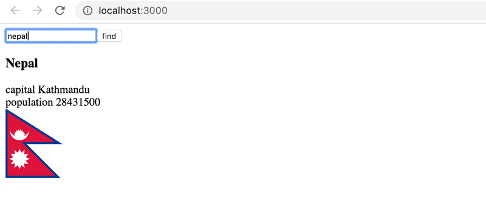
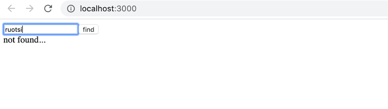

# Exercises

## Exercises 7.1-7.6: [routed-anecdotes](https://github.com/jokerinya/fsopen-part7/tree/main/routed-anecdotes)

## 7.7: country hook

Let's return to the exercises 2.12-14.

Use the code from https://github.com/fullstack-hy2020/country-hook as your starting point.

The application can be used to search for a country's details from the https://restcountries.com/ interface. If a country is found, the details of the country are displayed:

If no country is found, a message is displayed to the user:

The application is otherwise complete, but in this exercise you have to implement a custom hook `useCountry`, which can be used to search for the details of the country given to the hook as a parameter.

Use the api endpoint [full name](https://restcountries.com/#api-endpoints-v3-full-name) to fetch a country's details in a `useEffect` hook within your custom hook.

Note that in this exercise it is essential to use useEffect's [second parameter](https://reactjs.org/docs/hooks-reference.html#conditionally-firing-an-effect) array to control when the effect function is executed.

## Exercises 7.8: [ultimate-hooks](https://github.com/jokerinya/fsopen-part7/tree/main/ultimate-hooks)

## Exercise 7.9-7.21: [bloglist](https://github.com/jokerinya/fsopen-part7/tree/main/bloglist)
