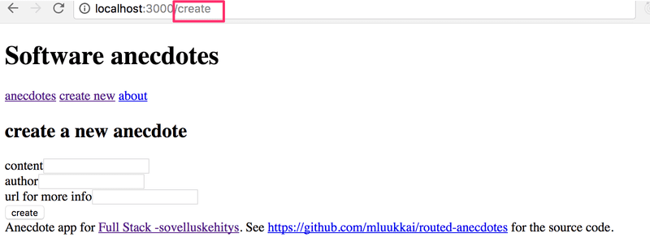

# Exercises

## Exercises 7.1.-7.3.

Let's return to working with anecdotes. Use the redux-free anecdote app found in the repository https://github.com/fullstack-hy2020/routed-anecdotes as the starting point for the exercises.

If you clone the project into an existing git repository, remember to _delete the git configuration of the cloned application:_

```bash
cd routed-anecdotes   // go first to directory of the cloned repository
rm -rf .git
```

The application starts the usual way, but first you need to install the dependencies of the application:

```bash
npm install
npm start
```

## 7.1: routed anecdotes, step1

Add React Router to the application so that by clicking links in the _Menu_ component the view can be changed.

At the root of the application, meaning the path `/`, show the list of anecdotes:


The _Footer_ component should always be visible at the bottom.

The creation of a new anecdote should happen e.g. in the path _create:_



## 7.2: routed anecdotes, step2

Implement a view for showing a single anecdote:


Navigating to the page showing the single anecdote is done by clicking the name of that anecdote:


## 7.3: routed anecdotes, step3

The default functionality of the creation form is quite confusing, because nothing seems to be happening after creating a new anecdote using the form.

Improve the functionality such that after creating a new anecdote the application transitions automatically to showing the view for all anecdotes _and_ the user is shown a notification informing them of this successful creation for the next five seconds:


> ## Exercises 7.4.-7.8.

We'll continue with the app from `exercises` of the chapter `react router`.

## 7.4: anecdotes and hooks step1

Simplify the anecdote creation form of your application with the `useField` custom hook we defined earlier.

One natural place to save the custom hooks of your application is in the `/src/hooks/index.js` file.

If you use the named export instead of the default export:

```js
import { useState } from 'react';

export const useField = (type) => {
    const [value, setValue] = useState('');

    const onChange = (event) => {
        setValue(event.target.value);
    };

    return {
        type,
        value,
        onChange,
    };
};

// modules can have several named exports
export const useAnotherHook = () => {
    // ...
};
```

Then importing happens in the following way:

```js
import { useField } from './hooks';

const App = () => {
    // ...
    const username = useField('text');
    // ...
};
```

## 7.5: anecdotes and hooks step2

Add a button to the form that you can use to clear all the input fields:


Expand the functionality of the _useField_ hook so that it offers a new reset operation for clearing the field.

Depending on your solution, you may see the following warning in your console:


We will return to this warning in the next exercise.

## 7.6: anecdotes and hooks step3

If your solution did not cause a warning to appear in the console, you have already finished this exercise.

If you see the warning in the console, make the necessary changes to get rid of the `Invalid value for prop 'reset' on <input> tag` console warning.

The reason for this warning is that after making the changes to your application, the following expression:

```html
<input {...content} />
```

Essentially, is the same as this:

```html
<input
    value="{content.value}"
    type="{content.type}"
    onChange="{content.onChange}"
    reset="{content.reset}"
/>
```

The _input_ element should not be given a reset attribute.

One simple fix would be to not use the spread syntax and write all of the forms like this:

```html
<input
    value="{username.value}"
    type="{username.type}"
    onChange="{username.onChange}"
/>
```

If we were to do this, we would lose much of the benefit provided by the _useField_ hook. Instead, come up with a solution that fixes the issue, but is still easy to use with spread syntax.

## Exercise 7.7: [country-hook](https://github.com/jokerinya/fsopen-part7/tree/main/country-hook)

## Exercises 7.8: [ultimate-hooks](https://github.com/jokerinya/fsopen-part7/tree/main/ultimate-hooks)

## Exercise 7.9-7.21: [bloglist](https://github.com/jokerinya/fsopen-part7/tree/main/bloglist)
