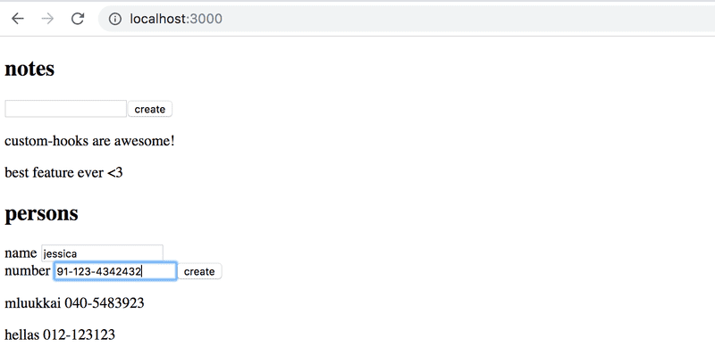

# Exercises

## Exercises 7.1-7.6: [routed-anecdotes](https://github.com/jokerinya/fsopen-part7/tree/main/routed-anecdotes)

## Exercise 7.7: [country-hook](https://github.com/jokerinya/fsopen-part7/tree/main/country-hook)

## 7.8: ultimate hooks

The code of the application responsible for communicating with the backend of the note application of the previous parts looks like this:

```js
import axios from 'axios';
const baseUrl = '/api/notes';

let token = null;

const setToken = (newToken) => {
    token = `bearer ${newToken}`;
};

const getAll = async () => {
    const response = await axios.get(baseUrl);
    return response.data;
};

const create = async (newObject) => {
    const config = {
        headers: { Authorization: token },
    };

    const response = await axios.post(baseUrl, newObject, config);
    return response.data;
};

const update = async (id, newObject) => {
    const response = await axios.put(`${baseUrl}/${id}`, newObject);
    return response.data;
};

export default { getAll, create, update, setToken };
```

We notice that the code is in no way specific to the fact that our application deals with notes. Excluding the value of the `baseUrl` variable, the same code could be reused in the blog post application for dealing with the communication with the backend.

Extract the code for communicating with the backend into its own `useResource` hook. It is sufficient to implement fetching all resources and creating a new resource.

You can do the exercise for the project found in the https://github.com/fullstack-hy2020/ultimate-hooks repository. The _App_ component for the project is the following:

```js
const App = () => {
    const content = useField('text');
    const name = useField('text');
    const number = useField('text');

    const [notes, noteService] = useResource('http://localhost:3005/notes');
    const [persons, personService] = useResource(
        'http://localhost:3005/persons'
    );

    const handleNoteSubmit = (event) => {
        event.preventDefault();
        noteService.create({ content: content.value });
    };

    const handlePersonSubmit = (event) => {
        event.preventDefault();
        personService.create({ name: name.value, number: number.value });
    };

    return (
        <div>
            <h2>notes</h2>
            <form onSubmit={handleNoteSubmit}>
                <input {...content} />
                <button>create</button>
            </form>
            {notes.map((n) => (
                <p key={n.id}>{n.content}</p>
            ))}

            <h2>persons</h2>
            <form onSubmit={handlePersonSubmit}>
                name <input {...name} /> <br />
                number <input {...number} />
                <button>create</button>
            </form>
            {persons.map((n) => (
                <p key={n.id}>
                    {n.name} {n.number}
                </p>
            ))}
        </div>
    );
};
```

The `useResource` custom hook returns an array of two items just like the state hooks. The first item of the array contains all of the individual resources and the second item of the array is an object that can be used for manipulating the resource collection, like creating new ones.

If you implement the hook correctly, it can be used for both notes and phone numbers (start the server with the `npm run server` command at the port 3005).



## Exercise 7.9-7.21: [bloglist](https://github.com/jokerinya/fsopen-part7/tree/main/bloglist)
